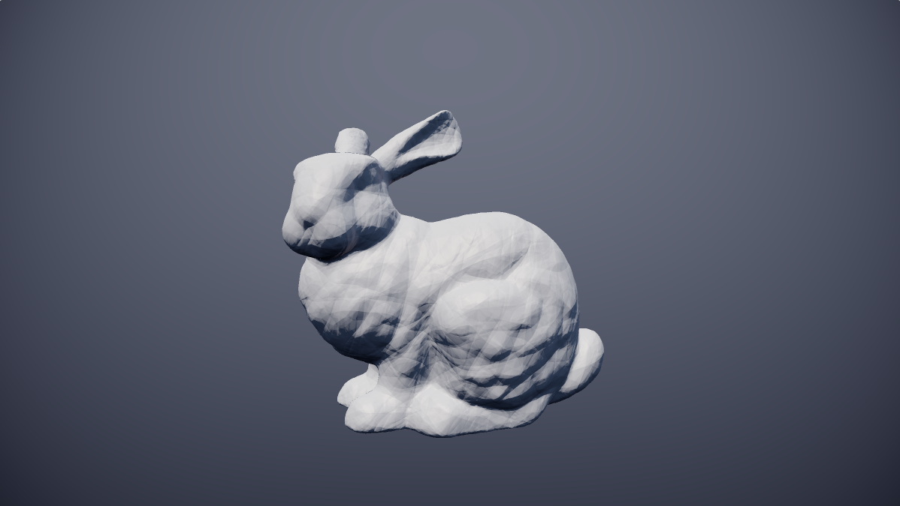

# nsdf

Representing SDFs of arbitrary meshes has been a bit tricky so far. Expressing the mesh SDF as a combination of simpler analytical SDFs is usually not possible, but we could either use pre-computed SDF 3D textures or use [acceleration structures with triangle mesh directly](https://iquilezles.org/www/articles/sdfbounding/sdfbounding.htm). The downside with those is that they're not as plug-and-play as analytical SDFs, because you need to push additional data to the shader (which is not really possible in something like [Shadertoy](https://www.shadertoy.com/)). Wouldn't it be cool to have a way of representing a mesh SDF with just some code we can directly paste into our raymarcher, as we do with simple analytical SDFs?

Over the past few years, another promising option for representing SDFs of arbitrary meshes came to existence - neural approximations of SDFs (let's call them nsdfs):
- https://arxiv.org/abs/1901.05103
- https://arxiv.org/abs/2006.10739
- https://nvlabs.github.io/instant-ngp/
- ...

Are these nsdfs usable outside of "lab"? The networks described in the papers are either too big (millions of parameters) to be represented purely in code, or require additional 3d textures as inputs (again millions of parameters). So, can we make them into copy-pastable distance functions which are usable in Shadertoy? Yes, yes we can:


[See in action on Shadertoy](https://www.shadertoy.com/view/NlKXWw)

This is a quite large nsdf of Stanford dragon running in Shadertoy, at ~25fps on 3080RTX in 640x360 resolution. Not perfect, but not bad at all.

The nsdf function in shader looks something like this:
```
float nsdf(vec3 x) {
    vec4 x_e_0 = mat3x4(vec4(-0.6761706471443176, -0.5204018950462341, -0.725279688835144, 0.6860896944999695), vec4(0.4600033164024353, 2.345594644546509, 0.4790898859500885, -1.7588382959365845), vec4(0.0854012668132782, 0.11334510892629623, 1.3206489086151123, 1.0468124151229858)) * x * 5.0312042236328125;vec4 x_0_0 = sin(x_e_0);vec4 x_0_12 = cos(x_e_0);vec4 x_e_1 = mat3x4(vec4(-1.151658296585083, 0.3811194896697998, -1.270230770111084, -0.28512871265411377), vec4(-0.4783991575241089, 1.5332365036010742, -1.1580479145050049, -0.038533274084329605), vec4(1.764098882675171, -0.8132078647613525, 0.607886552810669, -0.9051652550697327)) .....
)
```
The second line continues for much, much longer and it would take up most of the space on this README.


There's actually no magic to make it work, it's enough to just train a smaller network with [fourier features](https://arxiv.org/abs/2006.10739) as inputs.

Surprisingly (not!), the smaller the network, the lower the detail of the resulting model (but on the flip side, the model looks more stylized):

- **32 fourier features, 2 hidden layers of 16 neurons**
- **should work in real time on most modern-ish gpus**


- **64 fourier features, 2 hidden layers of 64 neurons**
- **3080RTX can still run this at 60FPS at 640x360)**
- **Note that it takes a few seconds to compile the shader**


- **96 fourier features, 1 hidden layer of 96 neurons**
- **~25 fps at 640x360 on 3080RTX**
- **Note that it can take tens of seconds to compile the shader**


### **Using sigmoid as activation function**

Replacing ReLU with Sigmoid as the activation function makes the model produce SDF with smoother, but less detailed surface.


## Generating your own nsdf

To generate your own nsdf, you first have to train a nsdf model:
```
python train.py $YOUR_MESH_FILE --output $OUTPUT_MODEL_FILE --model_size {small, normal, bigly}
```

Once the model is trained, you can generate GLSL nsdf function: 

```
python generate_glsl.py $OUTPUT_MODEL_FILE
```
Then you can just copy-paste the generated code into your raymarcher.

**WARNING:** The "bigly" models can crash your browser if your gpu is not enough. 

## Setup
Following pip packages are required for training:
```
mesh-to-sdf
numpy
torch
trimesh
```
(you can just run `pip install -r requirements.txt`)

## Notes:
- The nsdf function is defined only in [-1, 1] cube, you have to handle evaluation outside of that range.
- Related to above, I handle evaluating outside [-1, 1] cube by first checking for distance to the unit cube itself, and only after reaching that cube, nsdf is used. This has positive performance impact, so keep that in mind when reading FPS numbers above.
- For smaller models, it might be the best to train multiple models and select the best one since there's visible variance in the quality.
